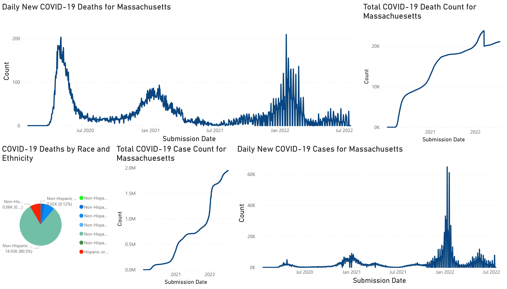

# Updated: 08/10/2022   

Visualization and analysis of new COVID-19 cases throughout the different towns and counties in Massachusetts. Dataset includes daily and weekly new positive infections and cumulative sums since the start of the pandemic for each of the 14 Massachusetts counties. Visualization is also done for COVID-19 case count data taken for all 50 states, as well as cases by age group and vaccination status. 

Massachusetts's data was collected from August 19th, 2020 to June 17th, 2022 for the daily dataset, and December 6th, 2020 to June 11th, 2022 for the weekly dataset. Taken from the Archive of COVID-19 cases in Massachusetts in the Mass.gov website. Original data was extracted by the Massachusetts Department of Public Health (DPH). 
Link to download data for MA: https://www.mass.gov/info-details/archive-of-covid-19-cases-in-massachusetts 

Nationwide data is extracted from the CDC data repository, which ranges from January 22nd, 2020 to June 16th, 2022. 
Nationwide data: https://data.cdc.gov/Case-Surveillance/United-States-COVID-19-Cases-and-Deaths-by-State-o/9mfq-cb36 
Cases per Age Group and Vaccination Status data: https://data.cdc.gov/Public-Health-Surveillance/Rates-of-COVID-19-Cases-or-Deaths-by-Age-Group-and/3rge-nu2a 
Deaths per Race and EthnicityL https://data.cdc.gov/NCHS/Provisional-COVID-19-Deaths-Distribution-of-Deaths/pj7m-y5uh  

**Links:** 

[GitHub page](https://juan-varela11.github.io/COVID_Cases_MA_and_Nationwide)

[Interactive visualization of New Daily COVID-19 Cases in Massachusetts](https://juan-varela11.github.io/COVID_Cases_MA_and_Nationwide/MA_covid_cases.html)

[Interactive visualization of Total COVID-19 Cases in Massachusetts](https://juan-varela11.github.io/COVID_Cases_MA_and_Nationwide/MA_tot_covid_cases.html)

[Interactive visualization of New Daily COVID-19 Related Deaths in Massachusetts](https://juan-varela11.github.io/COVID_Cases_MA_and_Nationwide/MA_covid_deaths.html)

[Interactive visualization of Total COVID-19 Related Deaths in Massachusetts](https://juan-varela11.github.io/COVID_Cases_MA_and_Nationwide/MA_tot_covid_deaths.html)

[Distribution of total COVID-19 Deaths (%) by Race and Ethnicity](https://juan-varela11.github.io/COVID_Cases_MA_and_Nationwide/race_deaths_MA.png)

# CDC Weekend Reporting: 
From what can be observed in the above plots of new daily COVID-19 cases and deaths in Massachusetts, it appears that of late October 2021, the CDC has stopped recording new deaths and cases on the weekend and federal holidays. On those days, they instead report that there are 0 new deaths and cases. 

# Lowered COVID-19 death count for Massachusetts: 
**NOTE (07/09/2022)** - Total count of COVID-19 deaths goes from 23,751 on March 13th, 2022 down to 19,981 on March 14th, 2022 (dip can be seen in plot above). Reason for decrease in total number is unknown, reached out to Dataset owner Brian Lee.  
**RESOLVED (07/15/2022)** - Answered received from CDC via email:   The State of Massachusetts Department of Public Health included a press release on March 10th that explains the reduction in the reported number of deaths. 
https://www.mass.gov/news/department-of-public-health-updates-covid-19-death-definition    
"CDC reports death data on three other sections of the website: U.S. Cases & Deaths, COVID Data Tracker, and NCHS Provisional Death Counts. The U.S. Cases and Deaths webpages and COVID Data Tracker get their information from the same source (Aggregate Jurisdictional Data); however, NCHS Death Counts are based on death certificates that use information reported by physicians, medical examiners, or coroners in the cause-of-death section of each certificate. Data from each of these pages are considered provisional (not complete and pending verification) and are therefore subject to change. Counts from previous weeks are continually revised as more records are received and processed. Because not all jurisdictions report counts daily, counts may increase at different intervals."   
 

# Datasets yet to be visualized for MA:

https://data.cdc.gov/Vaccinations/COVID-19-Vaccinations-in-the-United-States-County/8xkx-amqh (not in website yet, but is in Power BI report) 
https://data.cdc.gov/Vaccinations/COVID-19-Vaccinations-in-the-United-States-Jurisdi/unsk-b7fc (not in website yet, but is in Power BI report) 
